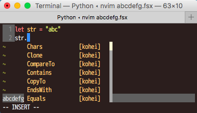

#Neovimfs

Neovimfs is that Fsi and intellisense works on Suave server.

###Install
```
$ git clone https://github.com/callmekohei/Neovimfs
```

###Required

01. Suave
02. FSharp.Compiler.Service


###How to use
01. compile `neovim.fsx` file
02. mono neovim.exe
03. access port8080

<br>
<br>

###Neovim configuration
init.vim
```vim
autocmd BufRead,BufNewFile *.fsx set filetype=fsharp
```

###QuickRun with Neovimfs


Required
- vim-quickrun
    - https://github.com/thinca/vim-quickrun

create `fio.bash`
```bash
urlencoded_str=$(curl -s -w '%{url_effective}\n' --data-urlencode $1 -G '')
urlencoded_str=${urlencoded_str:2}
curl -s 'localhost:8080/evalScript/'${urlencoded_str}
```

create `fio` command
```bash
$ cp fio.bash fio

$ chmod 777 fio

$ sudo mv fio /usr/local/bin
```

quickrun configuration
```vim
\     , 'fsharp': {
\           'exec'   :  [ '%c %s:p:r.fsx']
\         , 'command':  'fio'
\     }
```

<br>
<br>

###Intellisense completion with Neovimfs



Required

- deoplete.vim

    - https://github.com/Shougo/deoplete.nvim

- deoplete-fsharp

    - https://github.com/callmekohei/deoplete-fsharp

deoplete configuration
```vim
let g:deoplete#enable_at_startup = 1
let g:deoplete#max_list = 500
```

<br>
<br>


###LICENCE
The MIT License (MIT)
